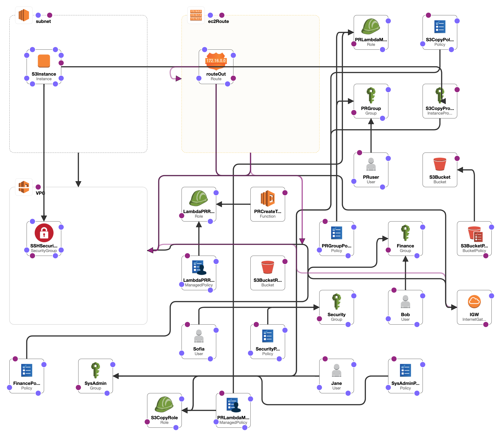

<h1> aws-iam-demo-project</h1>
<h2>Infrastructure Design</h2>

<h3>
	Project Details
</h3>

	As an IAM and project admin, provide necessary means for photographers and guests to upload pictures to the hotel website. Find a way to durably store and display pictures on the hotel website. Since the photos are sent by photographers and guests they are inconsistently sized and needed to be resized into thumbnails.  

<h4>
	Solution Details
</h4>

	
 
	Create an S3 bucket for photographers and guests to upload photography 

	
 
	In order for photographers and guests to access this bucket create an IAM user(PRuser) under the newly created PRGroup IAM Group and create a role that the user(PRuser) with necessary permission/policies can assume to access/upload to the bucket.

	

		Create an AWS Lambda function that will resize the images uploaded to the S3 bucket, the resized images, will be placed in another S3 bucket for resized photos and be accessed by the hotel website. For the Lambda function to access these buckets, create an IAM role specifically for the function. To modify this Lambda and its resources, create an IAM role that has permissions that only certain members can assume that give access to the Lambda function to resize the images. 
	

